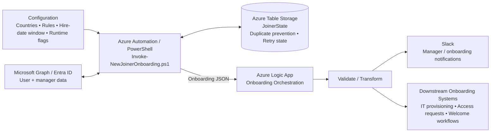

# Global New Joiner Onboarding

A global employee onboarding automation solution using **PowerShell, Microsoft Graph / Entra ID, Azure Automation, Azure Table Storage, Azure Logic Apps, and Slack**.

The solution identifies eligible new joiners, applies onboarding business rules, retrieves manager information, maintains processing state, and sends structured onboarding data to a Logic App for orchestration of notifications and downstream onboarding workflows.

## Architecture

The high-level integration flow is:



See the detailed architecture documentation: [`docs/logic-app-architecture.md`](docs/logic-app-architecture.md).

## Core capabilities

- Global country-based onboarding configuration
- New-joiner eligibility and hire-date filtering
- Department and job-title business rules
- Microsoft Graph / Entra ID user and manager lookup
- Azure Table Storage state management
- Duplicate prevention and retry handling
- Dry-run support
- Optional password reset workflow
- Structured JSON hand-off to Azure Logic Apps
- Slack onboarding notifications
- Extensible downstream onboarding orchestration

## Recommended repository structure

```text
new-joiner-onboarding/
├── scripts/
│   └── Invoke-NewJoinerOnboarding.ps1
├── config/
│   ├── countries.json
│   └── onboarding-rules.json
├── docs/
│   ├── logic-app-architecture.md
│   ├── architecture.md
│   ├── business-rules.md
│   └── runbook.md
├── tests/
├── README.md
└── .gitignore
```

## Security

Do not commit credentials, access tokens, client secrets, passwords, or other sensitive values to this repository.

In particular, initial passwords should **not** be included in general-purpose onboarding JSON, Slack messages, logs, or documentation. If credential delivery is required, use an approved secure secret-delivery mechanism.

## Scope

This repository is intended to support **global onboarding**. Countries, business rules, and Field Sales exceptions should be treated as configuration so that additional regions can be added without redesigning the core workflow.
