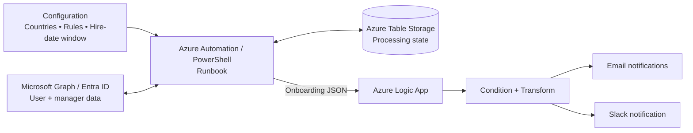

# Global New Joiner Onboarding

A production-oriented new-joiner onboarding automation pattern using **PowerShell, Microsoft Graph / Entra ID, Azure Automation, Azure Table Storage, Azure Logic Apps, and Slack**.

The solution discovers eligible new joiners, applies country/hire-date/business rules, retrieves manager information, tracks processing state, and hands structured onboarding data to a Logic App for notification orchestration.

## Current notification design

The notification flow is deliberately state-aware:

- **Processed users** trigger notifications when a new onboarding result is produced.
- **First-time missing personal email** records trigger an IT/Slack notification.
- Previously reported missing-email users are silently skipped until their email is added or their hire date changes.
- A run with **0 processed users and 0 new IT notifications sends no Slack message and no IT report**.

## Business rules

- Country is an eligibility requirement. Users with no country are not processed.
- Department is **not** a general mandatory attribute.
- `Field_Sales` remains a special case and is processed only for approved job titles.
- Hire date must exist and fall inside the configured window.
- Personal email (`OtherMails`) is required before onboarding can proceed.
- Missing manager information is treated as a warning rather than a blocking condition.

See [`docs/business-rules.md`](docs/business-rules.md).

## Architecture



See [`docs/logic-app-architecture.md`](docs/logic-app-architecture.md).

## Repository structure

```text
new-joiner-onboarding/
├── scripts/
│   └── Invoke-NewJoinerOnboarding.ps1
├── logic-app/
│   └── workflow.template.json
├── docs/
│   ├── architecture.md
│   ├── business-rules.md
│   ├── logic-app-architecture.md
│   ├── logic-app-select-fix.md
│   └── notification-flow-fix.md
├── tests/
├── README.md
└── .gitignore
```

## Important Logic App detail

`Select_Processed_Rows` and `Select_Skipped_Rows` must return **arrays of HTML strings**, not arrays of objects with an empty property name.

Use Select **text mode** with an expression such as:

```text
@{concat(...)}
```

Then `join(..., '')` can safely concatenate the rows.

See [`docs/logic-app-select-fix.md`](docs/logic-app-select-fix.md).

## Security

The repository contains templates and sanitized examples only. Do not commit:

- access tokens or client secrets
- passwords
- Slack webhook URLs
- tenant/subscription identifiers that are not intended for publication
- employee names, work emails, or other personal data
- production connection IDs

Use placeholders in repository templates and configure environment-specific values in Azure.

## Change log

The current notification-flow update removes the department mandatory check, keeps country filtering, makes missing personal email the explicit blocking attribute, fixes the diagnostic `missingOtherMail` logic, and preserves the zero-activity Slack rule.
