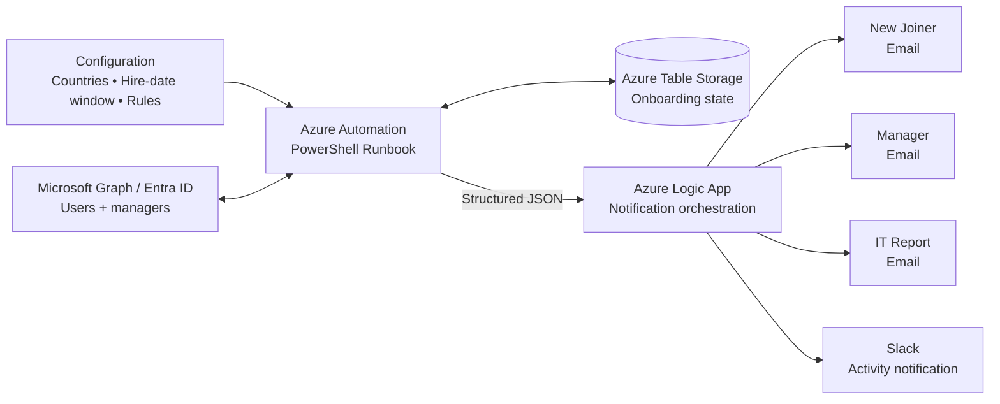

# New Joiner Onboarding Automation

> Portfolio project: an end-to-end JML onboarding workflow built around Azure Automation, PowerShell, Microsoft Graph, Azure Table Storage and Azure Logic Apps.

[](https://learn.microsoft.com/powershell/)
[](https://learn.microsoft.com/azure/automation/)
[](https://learn.microsoft.com/graph/)
[](https://learn.microsoft.com/azure/logic-apps/)

## Project overview

This project automates the operational workflow for new joiners from eligibility detection through onboarding notification and IT reporting.

The core automation runs as a PowerShell Runbook. It reads user and manager information through Microsoft Graph, applies configurable onboarding rules, persists processing state in Azure Table Storage, and emits a structured JSON result consumed by an Azure Logic App.

The Logic App turns that result into user onboarding emails, manager notifications, an IT report, and a Slack notification when there is meaningful activity.

This repository is a **sanitized portfolio implementation**. Production-specific identifiers, endpoints, personal data, secrets, and connection details are intentionally replaced with placeholders.

## Why this project is interesting

This is not only a provisioning script. The main engineering challenge is making the workflow **predictable, state-aware, and safe to operate repeatedly**.

The implementation demonstrates:

- **Eligibility filtering** — country and hire-date rules are evaluated before onboarding actions.
- **Business-rule exceptions** — `Field_Sales` has an additional job-title requirement while department remains optional for normal users.
- **Blocking vs warning attributes** — missing personal email blocks onboarding; missing manager information produces a warning.
- **Idempotent notifications** — Azure Table Storage prevents repeated IT/Slack alerts for the same missing-email condition.
- **Structured integration** — the Runbook produces a stable JSON contract for the Logic App.
- **Conditional notifications** — Slack and IT reporting are suppressed when there is no newly processed user and no first-time notification-worthy skip.
- **Operational diagnostics** — skipped users carry explicit reasons such as `otherMail` instead of relying on inferred fields.
- **Portfolio-safe design** — environment-specific values are configuration placeholders rather than embedded production details.

## Architecture



See [`docs/architecture.md`](docs/architecture.md) for the component responsibilities and data flow.

## End-to-end flow

1. The scheduled automation starts with configured countries and a hire-date window.
2. Microsoft Graph supplies eligible user and manager data.
3. Country eligibility and hire-date requirements are evaluated.
4. Department remains optional except for the `Field_Sales` title rule.
5. Personal email (`OtherMails`) is validated as a blocking onboarding requirement.
6. Existing Table Storage state is checked to avoid duplicate missing-email notifications.
7. Eligible users are processed and their onboarding state is persisted.
8. The Runbook returns structured JSON containing processed users, skipped users, notification-worthy skips, manager groups, and diagnostic counts.
9. The Logic App sends the appropriate user and manager notifications.
10. IT/Slack reporting occurs only when the run produced processed users or first-time notification-worthy skips.

## Business rules

| Area | Rule | Outcome |
|---|---|---|
| Country | Country must exist and be in the configured list | Otherwise ignored |
| Hire date | Hire date is required and must be inside the configured window | Otherwise ignored |
| Department | Not generally mandatory | User can continue without it |
| Field Sales | `Field_Sales` requires an approved job title | Otherwise skipped |
| Personal email | `OtherMails` is required | Blocks onboarding and creates a skip record |
| Manager | Missing manager is allowed | Warning only |
| Repeat missing email | Same user + same hire date already notified | No repeated IT/Slack alert |
| Zero activity | No processed users and no new notification-worthy skips | No Slack / IT report |

The detailed rules are documented in [`docs/business-rules.md`](docs/business-rules.md).

## Repository structure

```text
new-joiner-onboarding/
├── README.md
├── scripts/
│   └── Invoke-NewJoinerOnboarding.ps1
├── logic-app/
│   └── workflow-notification-template.json
└── docs/
    ├── architecture.md
    ├── business-rules.md
    ├── logic-app-select-fix.md
    └── notification-flow-fix.md
```

## Key implementation details

### State-aware notification

Missing personal email is a blocking condition, but the same user should not generate a new IT/Slack alert on every scheduled run. The Runbook therefore records the onboarding state and distinguishes a first notification from an already-reported condition.

### Stable output contract

The Runbook exposes separate collections for different consumers, including:

- `users` — successfully processed joiners
- `skippedUsers` — skipped records with reasons
- `skippedUsersToNotify` — only first-time notification-worthy skips
- `matchedUsersCount` — processed-user count
- `skippedUsersCount` — total skipped-user count
- `skippedNotifyCount` — notification-worthy skip count

This separation lets the Logic App make notification decisions without reconstructing business logic.

### Logic App HTML transformation

The Logic App uses Select actions to build HTML table rows. Those Select actions must operate in **text mode** so the result is an array of HTML strings. The Join action then combines the strings into the final report.

The repository includes the troubleshooting note in [`docs/logic-app-select-fix.md`](docs/logic-app-select-fix.md).

## Security and sanitization

The repository intentionally excludes production secrets and identifiers. Do not add:

- access tokens, client secrets, passwords, or certificates
- Slack webhook URLs or other secret endpoints
- employee names, personal/work email addresses, or production user data
- Azure tenant, subscription, resource, or connection identifiers unless intentionally public
- production Logic App callback URLs

Configure environment-specific values in Azure rather than committing them to source control.

## Portfolio / learning outcomes

This project demonstrates practical experience with:

- PowerShell automation and defensive control flow
- Microsoft Graph user and manager integration
- Azure Automation Runbooks
- Azure Table Storage state management
- Azure Logic Apps and JSON-based integration contracts
- Email and Slack notification orchestration
- Idempotency and duplicate-notification prevention
- Translating business requirements into explicit technical rules
- Troubleshooting workflow data transformations
- Sanitizing production automation for reusable documentation

## Project status

The repository is being maintained as a portfolio-safe reference implementation. The code reflects the onboarding workflow and notification fixes developed during the project while keeping production-specific configuration outside source control.

## License

No license is currently declared. If this repository is made public, add a license that matches how you want others to use the portfolio code.
