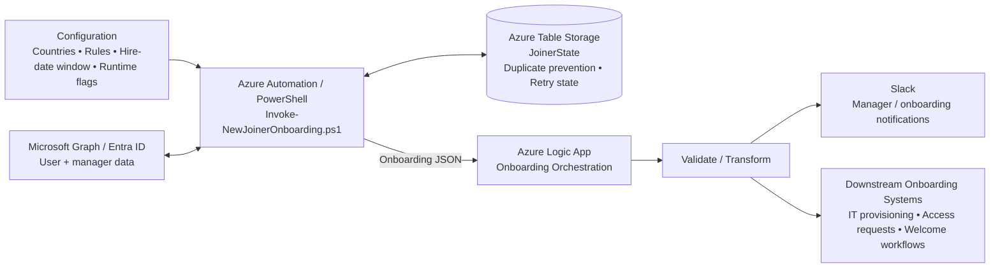

# Logic App Architecture

## Overview

The onboarding automation is designed as a global workflow in which PowerShell handles employee discovery and eligibility, Azure Table Storage maintains processing state, and an Azure Logic App orchestrates notifications and downstream onboarding actions.

## End-to-end flow

## Responsibilities

| Component | Responsibility |
|---|---|
| Azure Automation / PowerShell | Finds eligible joiners, applies business rules, retrieves manager details, manages onboarding state, and prepares the Logic App payload. |
| Microsoft Graph / Entra ID | Provides user and manager information and supports account/password operations where enabled. |
| Azure Table Storage | Tracks onboarding state, prevents duplicate processing, and supports retry handling. |
| Azure Logic App | Receives the onboarding payload, validates/transforms it, and orchestrates notifications and downstream workflows. |
| Slack | Delivers onboarding notifications to the relevant managers/onboarding stakeholders. |
| Downstream systems | Represents future or existing provisioning, access-request, and welcome workflows triggered by the orchestration layer. |

## Security note

Initial passwords or other credentials should not be included in general-purpose onboarding JSON, Slack messages, logs, or documentation. If credential delivery is required, use an approved secure secret-delivery mechanism.

## Design principles

- Global by design: country-specific rules are configuration rather than architecture boundaries.
- Idempotent processing: `JoinerState` is used to avoid duplicate onboarding actions.
- Retry-aware: failed processing can be identified and retried without duplicating successful work.
- Separation of concerns: PowerShell discovers and prepares data; Logic App orchestrates workflow actions.
- Observable: processing outcomes should be captured without exposing secrets or credentials.
